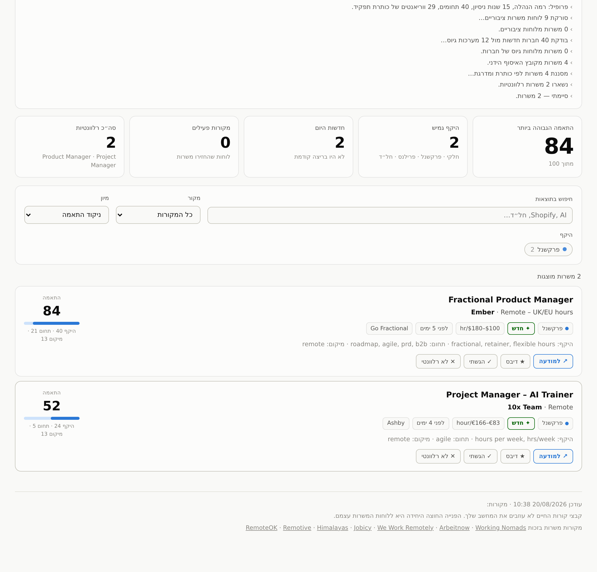

# JobDibs

**קוראים דיבס על המשרה לפני כולם.**
קורות החיים שלך לא עוזבים את המחשב.

כלי חיפוש עבודה מקומי. מעלים קורות חיים, כותבים כותרת תפקיד, והוא מושך משרות
פתוחות מלוחות הגיוס של חברות ומלוחות משרות מרחוק, מדרג כל אחת מ־0 עד 100 מול
פרופיל שהוא גוזר מהקו"ח, ומציג דשבורד מסודר.

עובד לכל סוג עבודה — **משרה מלאה, חלקית, פרקשנל, חוזה, סטודנטים והתמחות**
הם כולם בחירות שוות ערך. הוא חזק במיוחד במה שסינון לפי מילות מפתח מפספס,
שם הסיגנל — חלקיות, אינטרים, החלפה לחל"ד — קבור בגוף המודעה ולא בכותרת.

*[English](README.md)*



---

## הפעלה

```bash
python3 app.py
```

הדפדפן ייפתח על `http://127.0.0.1:8765`. זהו.

**בלי תלויות, בלי הרשמה, בלי שרת.** צריך רק Python 3.8 ומעלה — במק הוא מגיע
עם ה־Command Line Tools שמק מציע להתקין בפעם הראשונה, ובווינדוס מתקינים
מ־python.org.

לא רוצים לגעת בטרמינל?

- **ווינדוס** — לחיצה כפולה על **`Start JobDibs.bat`**
- **מק** — לחיצה כפולה על **`Start JobDibs.command`**, ואז אישור חד־פעמי:
  **System Settings ← Privacy & Security ← Open Anyway**

> **למה מק חוסם, ולמה זה לא באג.** כל קובץ שמורידים מהאינטרנט מסומן בדגל
> `com.apple.quarantine`, והדגל עובר לכל מה שנפרק מתוך ה־zip. סקריפט שלא
> נחתם אצל אפל — חתימה שעולה 99$ לשנה — ייחסם בלחיצה כפולה. אין לזה קשר
> לתוכן הקובץ, וזה קורה לכל פרויקט קוד פתוח שאינו חתום.
>
> שלוש דרכים לעקוף, לפי טעם:
> 1. האישור החד־פעמי ב־System Settings שלמעלה
> 2. להריץ `python3 app.py` מהטרמינל — Gatekeeper לא נכנס לתמונה בכלל
> 3. להסיר את הדגל מהתיקייה פעם אחת:
>    `xattr -dr com.apple.quarantine <נתיב-התיקייה>`
>
> **ומי שמשכפל את הריפו** (`git clone` או GitHub Desktop) לא נתקל בזה כלל —
> קבצים משוכפלים לא מסומנים.

**← [מדריך שלב אחר שלב לווינדוס ולמק](HOW-TO-USE.he.md)**

| דגל | |
|---|---|
| `--port 9000` | פורט אחר |
| `--no-browser` | לא לפתוח דפדפן |

---

## איך משתמשים

1. **כותרות תפקיד** — כותבים "מנהלת מוצר" או "Product Manager", Enter. אפשר כמה.
   כל כותרת מתורגמת אוטומטית לכל הווריאנטים שבאמת מופיעים במודעות: Senior,
   Lead, Head of, Owner, Principal, וגם בעברית.
2. **קורות חיים** — גוררים PDF / DOCX / TXT, או מדביקים טקסט.
3. **שוק ואזור** — ישראל · מרחוק · אירופה · ארה"ב, ובתוך כל אחד רשימת אזורים
   (בישראל: גוש דן, השרון, ירושלים, חיפה והצפון, שפלה, דרום, או כל הארץ).
4. **סוג העסקה** — עשר אפשרויות: מלאה, חלקית, פרקשנל, פרילנס, חוזה, חל"ד,
   אינטרים, סטודנטים/התמחות, משרת כניסה, משמרות. הסוגים שנבחרו עולים למעלה
   והאחרים יורדים ומסומנים.
5. **חיפוש** — 1–4 דקות בריצה הראשונה, פחות אחר כך.

אפשר לשמור כמה חיפושים ולעבור ביניהם — למשל "PM חלקי בישראל" מול
"TPM מרחוק באירופה".

---

## מה קורה מתחת למכסה

**קריאת הקו"ח.** `pdftext.py` מחלץ טקסט מ־PDF בלי שום ספרייה חיצונית, כולל
פונטים מסוג CID/Identity-H — מה שוורד, Pages ו־Google Docs מייצרים — דרך פענוח
מפות ToUnicode. DOCX נקרא ישירות מה־zip. אם מותקנות `pypdf` או `pdftotext`
הן ישמשו כשהן נותנות תוצאה טובה יותר. בקו"ח סרוקים כתמונה אין טקסט לחלץ,
ואז מדביקים את הטקסט ידנית.

**בניית הפרופיל.** רמת הסניוריטי נגזרת משנות הניסיון שמופיעות בטקסט, וזה קובע
את משקלי הכותרות: פרופיל הנהלה מקבל בונוס על "Head of" וקנס על "Junior",
ופרופיל ג'וניור מקבל את ההפך. תחומי התוכן מותאמים מול לקסיקון של כ־300 מונחים
בשבע־עשרה קבוצות — מוצר, צמיחה, איקומרס, AI ודאטה, עיצוב, הנדסה, QA, דליברי,
כספים, בריאות, חינוך, משפט, משאבי אנוש, מכירות, מסעדנות, מקצועות טכניים
ואדמיניסטרציה — וכל מונח מקבל משקל לפי תדירותו בקו"ח. מונחים קצרים כמו
`cad` או `rest` נבדקים לפי גבולות מילה, כך ש"אקדמיה" ו"מסעדה" לא נספרים.

**גילוי חברות אוטומטי.** כל שם חברה שמופיע בלוחות הציבוריים מנורמל ל־slug
ונבדק מול חמש מערכות גיוס. מה שנמצא נשמר ב־`data/discovered.json` ונטען בריצות
הבאות. **הרשימה גדלה מעצמה** — ההתנעה היא כ־76 חברות ישראליות ב־`markets.json`,
אבל היא לא נשארת כזו.

**הניקוד.**

| רכיב | משקל | מה נמדד |
|---|---|---|
| סוג העסקה | 24 או 40 | הסוגים שביקשתם מקבלים ניקוד, סוגים אחרים מקבלים קנס |
| תחום תוכן | 30 | חמשת המונחים החזקים מהפרופיל שמופיעים במודעה, כולל מילות מפתח שהוספתם |
| מיקום | ±20 | לפי השוק **והאזור** שנבחרו; "ארה"ב בלבד" או דרישת אשרה — קנס כבד |
| סניוריטי | ±10 | מול הרמה שנגזרה מהקו"ח |
| טריות | ±10 | עד שבוע ניקוד מלא, מעל 45 יום קנס |

הסיבות מוצגות מתחת לכל משרה, כך שרואים למה היא קיבלה את הניקוד שקיבלה.

---

## מקורות

**לוחות גיוס של חברות, מתגלים אוטומטית משם החברה:**
Greenhouse · Lever · Ashby · Recruitee · Workable · Personio · BambooHR ·
Breezy · Rippling · SmartRecruiters · JazzHR · Pinpoint

**Workday ו־Comeet** דורשות מזהה ייעודי שאי אפשר לנחש משם החברה, ולכן מוסיפים
אותן פעם אחת בהדבקת כתובת של דף קריירה — בתוך האפליקציה, או בשורת פקודה:

```bash
python3 app.py --learn https://acme.wd3.myworkdayjobs.com/en-US/AcmeCareers --name Acme
python3 app.py --learn https://www.comeet.co/jobs/acme/12.345 --name Acme
```

הן נשמרות ב־`boards.json` ונכללות בכל ריצה מכאן והלאה. Workday עובדת ב־POST
בלבד ומחזירה 20 משרות בכל פעם; ה־token של Comeet מתחלף, ולכן הוא נקרא מחדש
מדף הקריירה בכל ריצה. **Comeet שווה במיוחד בישראל** — חלק ניכר מחברות ההייטק
המקומיות משתמשות בה.

**לוחות משרות:** [RemoteOK](https://remoteok.com) ·
[Remotive](https://remotive.com) · [Himalayas](https://himalayas.app) ·
[Jobicy](https://jobicy.com) · [We Work Remotely](https://weworkremotely.com) ·
[Arbeitnow](https://www.arbeitnow.com) ·
[Working Nomads](https://www.workingnomads.com)

לחלק מהאתרים אין API — לינקדאין ורוב הלוחות המקומיים חוסמים גישה אוטומטית
לחלוטין. בשבילם יש `seed_jobs.json`: מדביקים לשם משרות ידנית והן מדורגות יחד עם
כל השאר. הקובץ מגיע ריק.

כל המקורות למעלה הם נקודות קצה ציבוריות ולא מאומתות. הפניות יוצאות מהמחשב שלך
בקצב שלך — אין שרת משותף ואין IP משותף.

---

## פרטיות

אין backend. האפליקציה מאזינה על `127.0.0.1` בלבד ולא נחשפת לרשת. קורות החיים
מפוענחים בתהליך הפייתון שלך; הטקסט נשמר רק ל־`data/profiles.json` על הדיסק שלך,
ורק אם לחצת "שמירת חיפוש". אין אנליטיקס, אין טלמטריה, אין דיווח קריסות,
אין חשבון.

הפניות היוצאות היחידות הן ללוחות המשרות, כדי למשוך מהם משרות.

---

## התאמות

**שוק או אזור אחר:** להוסיף בלוק ל־`markets.json` עם `label`, `positive`,
`negative`, `companies` ואופציונלית `regions`. שני התפריטים נבנים מהקובץ הזה,
אז כל מה שמוסיפים מופיע אוטומטית.

**תפקיד לא מוכר:** הכלי מייצר ווריאנטים לבד. לשליטה מדויקת — להוסיף ערך
ל־`ROLE_EXPANSIONS` ב־`engine.py`.

**ניקוד:** כל המשקלים ב־`engine.py` — `SCOPE_FAMILIES`, `LEXICON`, ומילוני
המיקום לכל שוק ב־`markets.json`.

---

## מצב הפרויקט

נבנה לחיפוש עבודה של אדם אחד ושוחרר כי אולי הוא יעזור למישהו נוסף. התחזוקה
היא על בסיס מיטב המאמץ, על ידי אדם אחד שמנהל סטארטאפ במקביל — issues ו־pull
requests מתקבלים בברכה, אבל תשובה אינה מובטחת.

נקודות הקצה של לוחות המשרות משתנות בלי הודעה. אם מקור מפסיק להחזיר תוצאות,
הכלי מדלג עליו בשקט, ובפוטר של הדשבורד רואים אילו מקורות באמת ענו.

רישיון **GNU AGPL-3.0**. מותר להשתמש, ללמוד, לשנות ולשתף. מי שמפיץ גרסה
משונה — או מריץ אותה כשירות שאנשים אחרים משתמשים בו — חייב לפרסם את הקוד שלו
תחת אותו רישיון.

השם JobDibs אינו כלול ברישיון. אפשר לעשות fork בחופשיות, אבל מי שמפרסם גרסה
משלו צריך לקרוא לה בשם אחר. פרטים ב־[NOTICE](NOTICE).


---

## הערה על השם

"Dibs" היא מילה אנגלית נפוצה ומוצרים לא קשורים רבים משתמשים בה.
JobDibs אינו קשור, מזוהה או מאושר על ידי אף אחד מהם.
